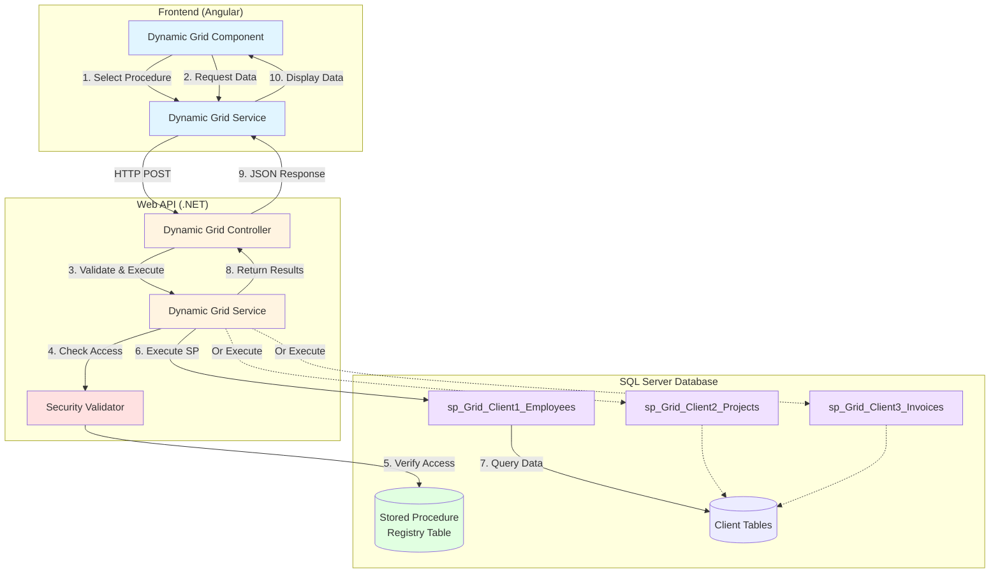
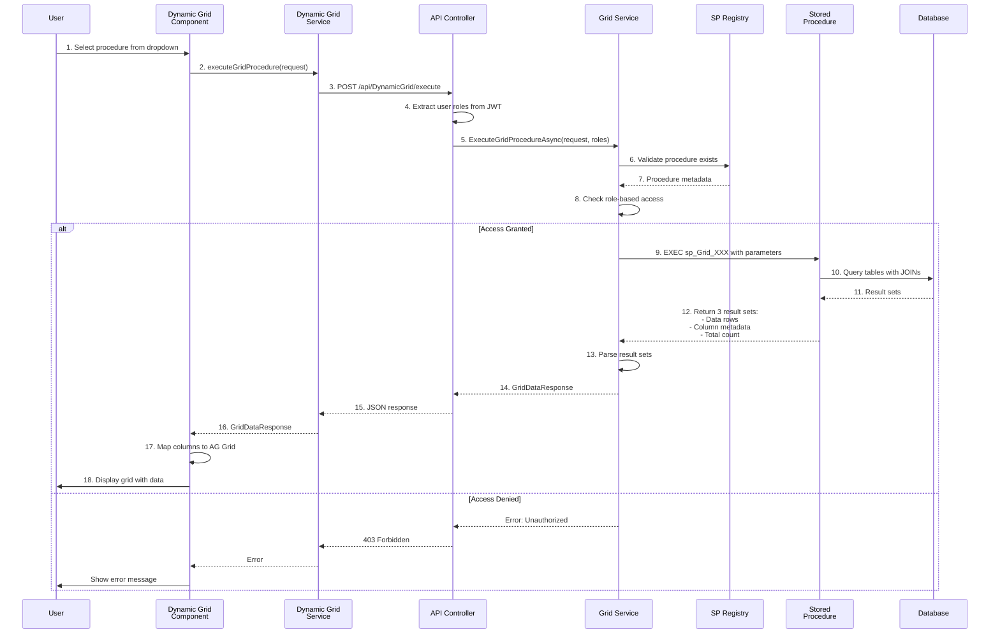
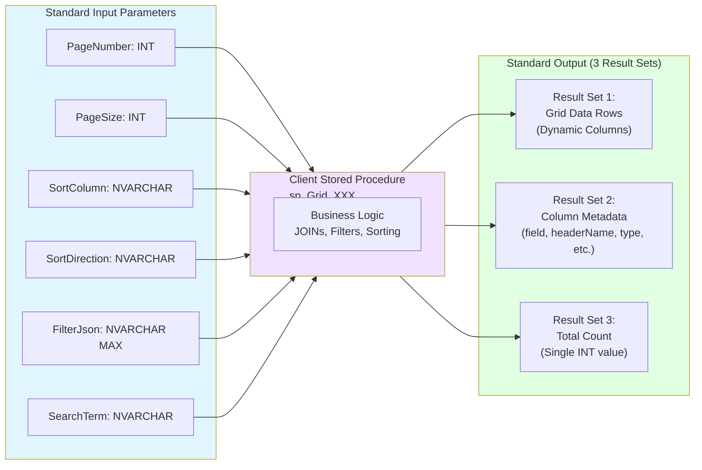
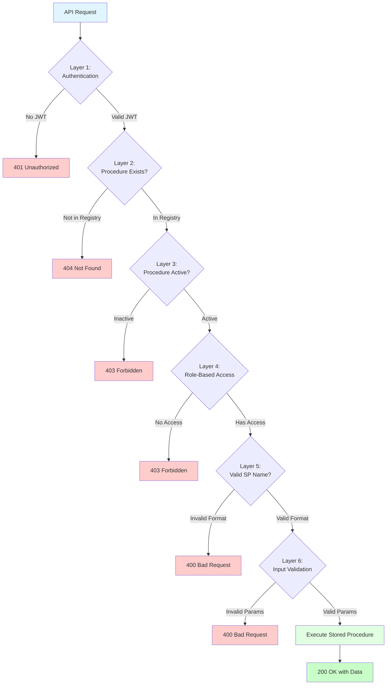
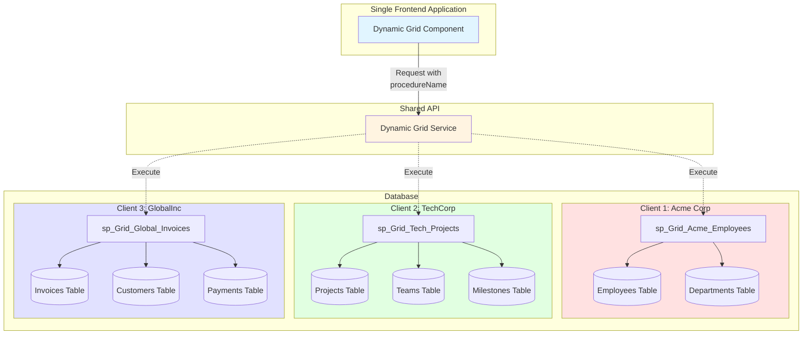
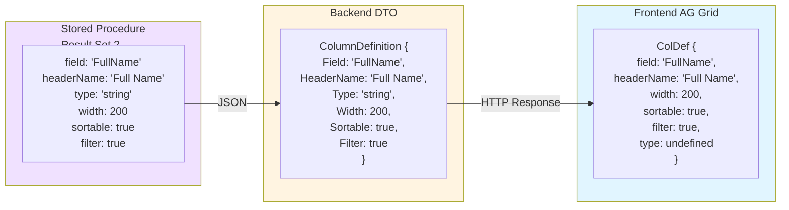
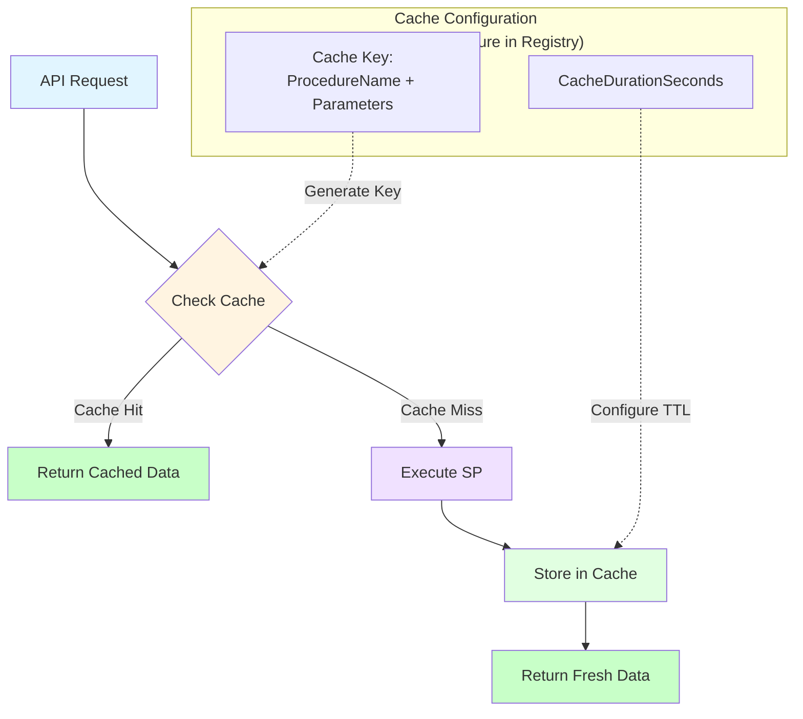
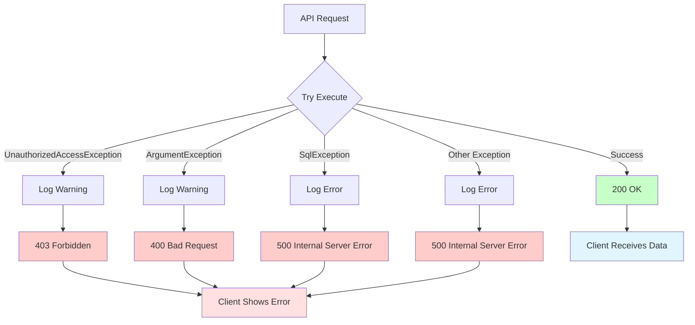

# Dynamic Grid Architecture - Visual Overview

## System Architecture

---

## Data Flow Sequence

---

## Standard Stored Procedure Contract

---

## Security Layers

---

## Client Onboarding Workflow

```mermaid
graph LR
    subgraph Client["Client Team"]
        C1[1. Define Data<br/>Requirements]
        C2[2. Create Stored<br/>Procedure]
        C3[3. Test SP<br/>Locally]
    end

    subgraph Admin["Admin/DBA"]
        A1[4. Review SP<br/>for Security]
        A2[5. Deploy SP to<br/>Database]
        A3[6. Register in<br/>SP Registry Table]
        A4[7. Set Allowed<br/>Roles]
    end

    subgraph System["System (Automatic)"]
        S1[8. API Discovers<br/>New SP]
        S2[9. Frontend Shows<br/>in Dropdown]
    end

    subgraph User["End User"]
        U1[10. Select & Use<br/>New Grid]
    end

    C1 --> C2 --> C3 --> A1
    A1 --> A2 --> A3 --> A4
    A4 --> S1 --> S2 --> U1

    style Client fill:#e1f5ff
    style Admin fill:#fff4e1
    style System fill:#e1ffe1
    style User fill:#f0e1ff
```

---

## Example: Multi-Client Scenario

---

## Column Definition Mapping

---

## Caching Strategy (Optional Enhancement)

---

## Error Handling Flow

