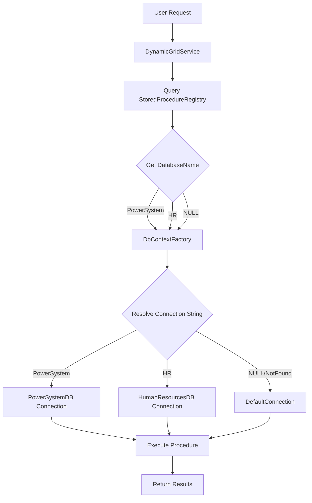

# Multi-Database Support Implementation Walkthrough

## Overview

Successfully implemented multi-database support for the dynamic grid system, enabling stored procedures to execute against different databases based on metadata in the `StoredProcedureRegistry` table.

## Architecture

**Pattern:** Database per Procedure
- Each procedure specifies its target database via `DatabaseName` field
- `DbContextFactory` creates connections to different databases
- `DynamicGridService` routes CRUD operations to correct database
- Fully backward compatible - NULL `DatabaseName` uses `DefaultConnection`

---

## Changes Made

### **1. Database Schema**

#### Added DatabaseName Column
**File:** [`add-database-name-column.sql`](file:///c:/Studymash/GridPortal/API/WebAPI/Database/Migrations/add-database-name-column.sql)

```sql
ALTER TABLE "StoredProcedureRegistry"
ADD COLUMN "DatabaseName" VARCHAR(100);

-- Add index for performance
CREATE INDEX idx_storedprocedureregistry_databasename 
ON "StoredProcedureRegistry"("DatabaseName")
WHERE "DatabaseName" IS NOT NULL;
```

#### Updated Existing Records
**File:** [`update-database-names.sql`](file:///c:/Studymash/GridPortal/API/WebAPI/Database/Migrations/update-database-names.sql)

```sql
-- PowerSystem Database
UPDATE "StoredProcedureRegistry"
SET "DatabaseName" = 'PowerSystem'
WHERE "ProcedureName" IN ('sp_Grid_Buses', 'sp_Grid_Delete_Bus', 'sp_Grid_Update_Bus');

-- HR Database
UPDATE "StoredProcedureRegistry"
SET "DatabaseName" = 'HR'
WHERE "ProcedureName" LIKE '%Employee%';
```

---

### **2. Model Updates**

#### StoredProcedureRegistry
**File:** [`StoredProcedureRegistry.cs`](file:///c:/Studymash/GridPortal/API/WebAPI/Models/StoredProcedureRegistry.cs)

**Added Property:**
```csharp
/// <summary>
/// Database identifier for routing procedure calls.
/// Maps to connection string names in appsettings.json.
/// If null, uses DefaultConnection.
/// Examples: "PowerSystem", "HR", "Finance"
/// </summary>
[MaxLength(100)]
public string? DatabaseName { get; set; }
```

---

### **3. Database Context Factory**

#### Interface
**File:** [`IDbContextFactory.cs`](file:///c:/Studymash/GridPortal/API/WebAPI/Data/IDbContextFactory.cs) - NEW

```csharp
public interface IDbContextFactory
{
    ApplicationDbContext CreateContext(string? databaseName = null);
    Task<DbConnection> CreateConnectionAsync(string? databaseName = null);
    string GetConnectionString(string? databaseName = null);
}
```

#### Implementation
**File:** [`DbContextFactory.cs`](file:///c:/Studymash/GridPortal/API/WebAPI/Data/DbContextFactory.cs) - NEW

**Key Features:**
- Resolves connection strings from configuration
- Falls back to `DefaultConnection` if database name not found
- Logs database routing for debugging
- Creates both `ApplicationDbContext` and raw `DbConnection`

**Connection String Resolution:**
```csharp
public string GetConnectionString(string? databaseName = null)
{
    if (string.IsNullOrWhiteSpace(databaseName))
    {
        return _configuration.GetConnectionString("DefaultConnection");
    }

    var connectionString = _configuration.GetConnectionString(databaseName);
    
    if (string.IsNullOrEmpty(connectionString))
    {
        _logger.LogWarning("Connection string '{DatabaseName}' not found. Falling back to DefaultConnection", databaseName);
        return _configuration.GetConnectionString("DefaultConnection");
    }
    
    return connectionString;
}
```

---

### **4. Service Updates**

#### DynamicGridService
**File:** [`DynamicGridService.cs`](file:///c:/Studymash/GridPortal/API/WebAPI/Services/DynamicGridService.cs)

**Constructor Changes:**
```csharp
private readonly IDbContextFactory _dbContextFactory;

public DynamicGridService(
    ApplicationDbContext context,
    IDbContextFactory dbContextFactory,  // NEW
    ILogger<DynamicGridService> logger)
{
    _context = context;
    _dbContextFactory = dbContextFactory;
    _logger = logger;
}
```

**ExecuteGridProcedureAsync:**
```csharp
// Get procedure metadata for database routing
var procedure = await _context.StoredProcedureRegistry
    .FirstOrDefaultAsync(p => p.ProcedureName == request.ProcedureName && p.IsActive);

var databaseName = procedure.DatabaseName;

_logger.LogInformation(
    "Executing procedure {ProcedureName} on database {DatabaseName}",
    request.ProcedureName,
    databaseName ?? "DefaultConnection");

// Create connection to target database
var connection = await _dbContextFactory.CreateConnectionAsync(databaseName);
```

**UpdateRowAsync:**
```csharp
// Get update procedure metadata
var updateProcedure = await _context.StoredProcedureRegistry
    .FirstOrDefaultAsync(p => p.ProcedureName == updateProcedureName && p.IsActive);

var databaseName = updateProcedure.DatabaseName;

// Create connection to target database
var connection = await _dbContextFactory.CreateConnectionAsync(databaseName);
```

**DeleteRowAsync:**
```csharp
// Get delete procedure metadata
var deleteProcedure = await _context.StoredProcedureRegistry
    .FirstOrDefaultAsync(p => p.ProcedureName == deleteProcedureName && p.IsActive);

var databaseName = deleteProcedure.DatabaseName;

// Create connection to target database
var connection = await _dbContextFactory.CreateConnectionAsync(databaseName);
```

---

### **5. Configuration**

#### appsettings.json
**File:** [`appsettings.json`](file:///c:/Studymash/GridPortal/API/WebAPI/appsettings.json)

**Added Connection Strings:**
```json
{
  "ConnectionStrings": {
    "DefaultConnection": "Host=localhost;Port=5432;Database=GridPortalDb;Username=postgres;Password=pass@12345",
    "PowerSystem": "Host=localhost;Port=5432;Database=PowerSystemDB;Username=postgres;Password=pass@12345",
    "HR": "Host=localhost;Port=5432;Database=HumanResourcesDB;Username=postgres;Password=pass@12345"
  }
}
```

---

### **6. Dependency Injection**

#### Program.cs
**File:** [`Program.cs`](file:///c:/Studymash/GridPortal/API/WebAPI/Program.cs)

**Added Registration:**
```csharp
// Database Configuration
builder.Services.AddDbContext<ApplicationDbContext>(options =>
    options.UseNpgsql(builder.Configuration.GetConnectionString("DefaultConnection")));

// Register DbContextFactory for multi-database support
builder.Services.AddScoped<IDbContextFactory, DbContextFactory>();
```

---

## Execution Steps

### **Step 1: Execute Database Migrations**

```sql
-- 1. Add DatabaseName column
\i 'C:\Studymash\GridPortal\API\WebAPI\Database\Migrations\add-database-name-column.sql'

-- 2. Update existing procedures with database names
\i 'C:\Studymash\GridPortal\API\WebAPI\Database\Migrations\update-database-names.sql'
```

### **Step 2: Verify Database Setup**

```sql
-- Check that column was added
SELECT column_name, data_type 
FROM information_schema.columns 
WHERE table_name = 'StoredProcedureRegistry' 
AND column_name = 'DatabaseName';

-- Check procedure assignments
SELECT "ProcedureName", "DatabaseName", "Category"
FROM "StoredProcedureRegistry"
ORDER BY "DatabaseName", "ProcedureName";
```

### **Step 3: Restart API**

The API will automatically pick up the new code changes and configuration.

---

## How It Works

### **Request Flow**



### **Example: Bus Grid Request**

1. **User** opens Bus grid
2. **Frontend** sends: `{ procedureName: "sp_Grid_Buses" }`
3. **Service** queries registry: `DatabaseName = "PowerSystem"`
4. **Factory** resolves: `PowerSystem` → `PowerSystemDB` connection string
5. **Service** executes: `sp_Grid_Buses` on `PowerSystemDB`
6. **Results** returned to frontend

### **Example: Employee Grid Request**

1. **User** opens Employee grid
2. **Frontend** sends: `{ procedureName: "sp_Grid_Employees" }`
3. **Service** queries registry: `DatabaseName = "HR"`
4. **Factory** resolves: `HR` → `HumanResourcesDB` connection string
5. **Service** executes: `sp_Grid_Employees` on `HumanResourcesDB`
6. **Results** returned to frontend

---

## Backward Compatibility

✅ **Fully Backward Compatible:**

- Procedures with `DatabaseName = NULL` → Use `DefaultConnection`
- Existing procedures continue to work without changes
- No breaking changes to API contracts
- Frontend code unchanged

**Example:**
```sql
-- Procedure without DatabaseName
SELECT "ProcedureName", "DatabaseName" 
FROM "StoredProcedureRegistry"
WHERE "ProcedureName" = 'sp_Grid_OldProcedure';

-- Result: DatabaseName = NULL
-- Behavior: Uses DefaultConnection automatically
```

---

## Testing Checklist

### **Database Setup**
- [ ] DatabaseName column added successfully
- [ ] Index created on DatabaseName
- [ ] Bus procedures assigned to PowerSystem
- [ ] Employee procedures assigned to HR

### **Grid Operations**
- [ ] Bus grid loads data from PowerSystemDB
- [ ] Employee grid loads data from HumanResourcesDB
- [ ] Pagination works across databases
- [ ] Sorting works across databases
- [ ] Filtering works across databases
- [ ] Global search works across databases

### **CRUD Operations**
- [ ] Update bus record (PowerSystemDB)
- [ ] Delete bus record (PowerSystemDB)
- [ ] Update employee record (HumanResourcesDB)
- [ ] Delete employee record (HumanResourcesDB)

### **Fallback Behavior**
- [ ] Procedure with NULL DatabaseName uses DefaultConnection
- [ ] Invalid DatabaseName falls back to DefaultConnection
- [ ] Logs warning for invalid database names

### **Logging**
- [ ] Database routing logged for each request
- [ ] Connection string resolution logged
- [ ] Fallback warnings logged

---

## Usage Examples

### **Adding a New Database**

**1. Add Connection String:**
```json
{
  "ConnectionStrings": {
    "Finance": "Host=localhost;Port=5432;Database=FinanceDB;..."
  }
}
```

**2. Assign Procedures:**
```sql
UPDATE "StoredProcedureRegistry"
SET "DatabaseName" = 'Finance'
WHERE "ProcedureName" IN ('sp_Grid_Invoices', 'sp_Grid_Update_Invoice', 'sp_Grid_Delete_Invoice');
```

**3. Done!** No code changes needed.

### **Moving Procedure to Different Database**

```sql
-- Move Bus procedures from PowerSystem to DefaultConnection
UPDATE "StoredProcedureRegistry"
SET "DatabaseName" = NULL
WHERE "ProcedureName" LIKE '%Bus%';
```

---

## Benefits

✅ **Scalability** - Add unlimited databases without code changes
✅ **Flexibility** - Each procedure can use different database
✅ **Maintainability** - Configuration-driven routing
✅ **Security** - Connection strings centralized in config
✅ **Performance** - Direct connections to target databases
✅ **Isolation** - Separate databases for different domains

---

## Summary

Successfully implemented multi-database support using the **Database per Procedure** pattern:

- ✅ Added `DatabaseName` column to `StoredProcedureRegistry`
- ✅ Created `DbContextFactory` for connection management
- ✅ Updated all CRUD operations in `DynamicGridService`
- ✅ Added multiple connection strings to configuration
- ✅ Registered factory in dependency injection
- ✅ Fully backward compatible
- ✅ Zero frontend changes required

The dynamic grid system now supports routing procedures to different databases based on simple configuration!
