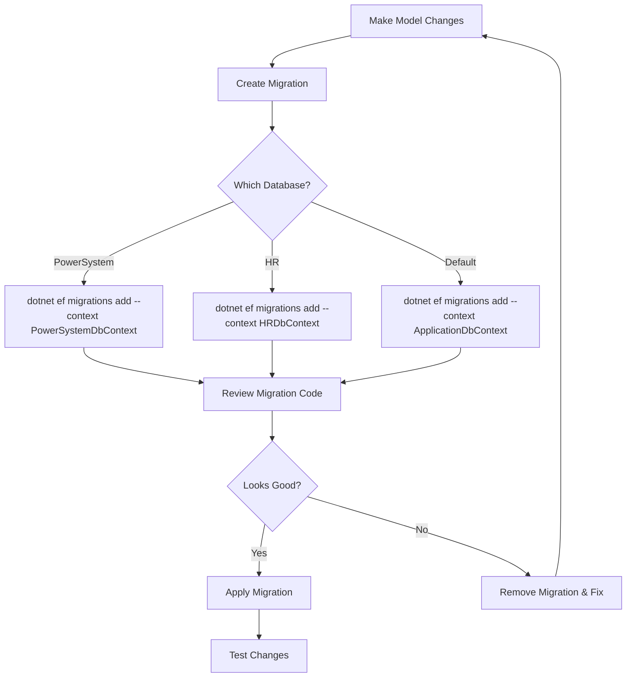

# Separate DbContexts for Multi-Database EF Migrations

## Overview

This guide explains how to use **separate DbContext classes** for each database when you want Entity Framework Core to manage schema migrations across multiple databases. This approach is ideal when you need EF's migration capabilities while maintaining a multi-database architecture.

---

## Architecture

### **Pattern: One DbContext per Database**

```
ApplicationDbContext → DefaultConnection (GridPortalDb_Dev)
  ├── StoredProcedureRegistry
  ├── Users
  └── Other shared entities

PowerSystemDbContext → PowerSystem (DynamicTable)
  ├── Bus
  ├── Generator
  └── Other power system entities

HRDbContext → HR (GridPortalDb_Dev or separate HR DB)
  ├── Employee
  ├── Department
  └── Other HR entities
```

---

## Implementation Steps

### **Step 1: Create Database-Specific DbContext Classes**

#### PowerSystemDbContext
**File:** `Data/PowerSystemDbContext.cs` (NEW)

```csharp
using Microsoft.EntityFrameworkCore;
using WebAPI.Models;

namespace WebAPI.Data;

/// <summary>
/// DbContext for PowerSystem database containing power grid entities.
/// </summary>
public class PowerSystemDbContext : DbContext
{
    public DbSet<Bus> Buses { get; set; }
    // Add other power system entities here
    // public DbSet<Generator> Generators { get; set; }
    // public DbSet<Transformer> Transformers { get; set; }

    public PowerSystemDbContext(DbContextOptions<PowerSystemDbContext> options)
        : base(options)
    {
    }

    protected override void OnModelCreating(ModelBuilder modelBuilder)
    {
        base.OnModelCreating(modelBuilder);

        // Configure Bus entity
        modelBuilder.Entity<Bus>(entity =>
        {
            entity.HasKey(e => new { e.ibus, e.CaseNumber });
            
            entity.ToTable("Bus");
            
            entity.Property(e => e.name)
                .HasMaxLength(255);
                
            entity.Property(e => e.baskv)
                .HasColumnType("decimal(10,2)");
                
            entity.Property(e => e.vm)
                .HasColumnType("decimal(10,4)");
                
            entity.Property(e => e.va)
                .HasColumnType("decimal(10,4)");
                
            entity.Property(e => e.nvhi)
                .HasColumnType("decimal(10,4)");
                
            entity.Property(e => e.nvlo)
                .HasColumnType("decimal(10,4)");
                
            entity.Property(e => e.evhi)
                .HasColumnType("decimal(10,4)");
                
            entity.Property(e => e.evlo)
                .HasColumnType("decimal(10,4)");
                
            // Create indexes
            entity.HasIndex(e => e.name)
                .HasDatabaseName("IX_Bus_Name");
        });
    }
}
```

#### HRDbContext
**File:** `Data/HRDbContext.cs` (NEW)

```csharp
using Microsoft.EntityFrameworkCore;
using WebAPI.Models;

namespace WebAPI.Data;

/// <summary>
/// DbContext for HR database containing employee and department entities.
/// </summary>
public class HRDbContext : DbContext
{
    public DbSet<Employee> Employees { get; set; }
    public DbSet<Department> Departments { get; set; }

    public HRDbContext(DbContextOptions<HRDbContext> options)
        : base(options)
    {
    }

    protected override void OnModelCreating(ModelBuilder modelBuilder)
    {
        base.OnModelCreating(modelBuilder);

        // Configure Employee entity
        modelBuilder.Entity<Employee>(entity =>
        {
            entity.HasKey(e => e.Id);
            
            entity.ToTable("Employees");
            
            entity.Property(e => e.FirstName)
                .IsRequired()
                .HasMaxLength(100);
                
            entity.Property(e => e.LastName)
                .IsRequired()
                .HasMaxLength(100);
                
            entity.Property(e => e.Email)
                .IsRequired()
                .HasMaxLength(255);
                
            entity.Property(e => e.Salary)
                .HasColumnType("decimal(18,2)");
                
            // Create indexes
            entity.HasIndex(e => e.Email)
                .IsUnique()
                .HasDatabaseName("IX_Employees_Email");
        });

        // Configure Department entity
        modelBuilder.Entity<Department>(entity =>
        {
            entity.HasKey(e => e.Id);
            
            entity.ToTable("Departments");
            
            entity.Property(e => e.Name)
                .IsRequired()
                .HasMaxLength(200);
        });
    }
}
```

---

### **Step 2: Update ApplicationDbContext**

**File:** `Data/ApplicationDbContext.cs`

```csharp
using Microsoft.EntityFrameworkCore;
using WebAPI.Models;

namespace WebAPI.Data;

/// <summary>
/// Default DbContext for shared/registry entities.
/// </summary>
public class ApplicationDbContext : DbContext
{
    // Only entities that belong to the default database
    public DbSet<StoredProcedureRegistry> StoredProcedureRegistry { get; set; }
    public DbSet<User> Users { get; set; }
    // Add other shared entities here

    public ApplicationDbContext(DbContextOptions<ApplicationDbContext> options)
        : base(options)
    {
    }

    protected override void OnModelCreating(ModelBuilder modelBuilder)
    {
        base.OnModelCreating(modelBuilder);

        // Configure StoredProcedureRegistry
        modelBuilder.Entity<StoredProcedureRegistry>(entity =>
        {
            entity.HasKey(e => e.Id);
            entity.ToTable("StoredProcedureRegistry");
            
            entity.Property(e => e.ProcedureName)
                .IsRequired()
                .HasMaxLength(200);
                
            entity.HasIndex(e => e.ProcedureName)
                .IsUnique();
        });

        // IMPORTANT: Exclude entities that live in other databases
        // This prevents EF from trying to create these tables in the default database
        modelBuilder.Ignore<Bus>();
        modelBuilder.Ignore<Employee>();
        modelBuilder.Ignore<Department>();
    }
}
```

---

### **Step 3: Register DbContexts in Program.cs**

**File:** `Program.cs`

```csharp
// Database Configuration - Multiple DbContexts
builder.Services.AddDbContext<ApplicationDbContext>(options =>
    options.UseNpgsql(
        builder.Configuration.GetConnectionString("DefaultConnection"),
        npgsqlOptions => npgsqlOptions.MigrationsHistoryTable("__EFMigrationsHistory", "public")
    ));

builder.Services.AddDbContext<PowerSystemDbContext>(options =>
    options.UseNpgsql(
        builder.Configuration.GetConnectionString("PowerSystem"),
        npgsqlOptions => npgsqlOptions.MigrationsHistoryTable("__EFMigrationsHistory", "public")
    ));

builder.Services.AddDbContext<HRDbContext>(options =>
    options.UseNpgsql(
        builder.Configuration.GetConnectionString("HR"),
        npgsqlOptions => npgsqlOptions.MigrationsHistoryTable("__EFMigrationsHistory", "public")
    ));

// Keep DbContextFactory for dynamic grid stored procedure routing
builder.Services.AddScoped<IDbContextFactory, DbContextFactory>();
```

---

### **Step 4: Update DbContextFactory**

**File:** `Data/DbContextFactory.cs`

The factory can now optionally use the registered DbContexts:

```csharp
public class DbContextFactory : IDbContextFactory
{
    private readonly IConfiguration _configuration;
    private readonly IServiceProvider _serviceProvider;
    private readonly ILogger<DbContextFactory> _logger;

    public DbContextFactory(
        IConfiguration configuration,
        IServiceProvider serviceProvider,
        ILogger<DbContextFactory> logger)
    {
        _configuration = configuration;
        _serviceProvider = serviceProvider;
        _logger = logger;
    }

    public ApplicationDbContext CreateContext(string? databaseName = null)
    {
        // Option 1: Use registered DbContext if available
        if (!string.IsNullOrEmpty(databaseName))
        {
            switch (databaseName)
            {
                case "PowerSystem":
                    return _serviceProvider.GetRequiredService<PowerSystemDbContext>();
                case "HR":
                    return _serviceProvider.GetRequiredService<HRDbContext>();
            }
        }

        // Option 2: Create new context with connection string (existing logic)
        var connectionString = GetConnectionString(databaseName);
        var optionsBuilder = new DbContextOptionsBuilder<ApplicationDbContext>();
        optionsBuilder.UseNpgsql(connectionString);
        return new ApplicationDbContext(optionsBuilder.Options);
    }

    // Rest of the factory implementation remains the same...
}
```

---

### **Step 5: Create and Run Migrations**

#### For PowerSystem Database

```bash
# Create initial migration
dotnet ef migrations add InitialCreate \
    --context PowerSystemDbContext \
    --output-dir Data/Migrations/PowerSystem

# Apply migration to database
dotnet ef database update --context PowerSystemDbContext

# For subsequent changes
dotnet ef migrations add AddGeneratorTable \
    --context PowerSystemDbContext \
    --output-dir Data/Migrations/PowerSystem

dotnet ef database update --context PowerSystemDbContext
```

#### For HR Database

```bash
# Create initial migration
dotnet ef migrations add InitialCreate \
    --context HRDbContext \
    --output-dir Data/Migrations/HR

# Apply migration to database
dotnet ef database update --context HRDbContext

# For subsequent changes
dotnet ef migrations add AddDepartmentTable \
    --context HRDbContext \
    --output-dir Data/Migrations/HR

dotnet ef database update --context HRDbContext
```

#### For Default Database

```bash
# Create initial migration
dotnet ef migrations add InitialCreate \
    --context ApplicationDbContext \
    --output-dir Data/Migrations/Default

# Apply migration to database
dotnet ef database update --context ApplicationDbContext
```

---

## Migration Folder Structure

```
Data/
├── Migrations/
│   ├── Default/
│   │   ├── 20250113_InitialCreate.cs
│   │   └── ApplicationDbContextModelSnapshot.cs
│   ├── PowerSystem/
│   │   ├── 20250113_InitialCreate.cs
│   │   └── PowerSystemDbContextModelSnapshot.cs
│   └── HR/
│       ├── 20250113_InitialCreate.cs
│       └── HRDbContextModelSnapshot.cs
├── ApplicationDbContext.cs
├── PowerSystemDbContext.cs
├── HRDbContext.cs
├── IDbContextFactory.cs
└── DbContextFactory.cs
```

---

## Using DbContexts in Services

### **Option 1: Inject Specific DbContext**

```csharp
public class BusService
{
    private readonly PowerSystemDbContext _context;
    
    public BusService(PowerSystemDbContext context)
    {
        _context = context;
    }
    
    public async Task<List<Bus>> GetBusesAsync()
    {
        return await _context.Buses
            .Where(b => b.baskv > 100)
            .ToListAsync();
    }
}
```

### **Option 2: Use DbContextFactory**

```csharp
public class DynamicService
{
    private readonly IDbContextFactory _factory;
    
    public DynamicService(IDbContextFactory factory)
    {
        _factory = factory;
    }
    
    public async Task ProcessData(string databaseName)
    {
        using var context = _factory.CreateContext(databaseName);
        // Work with context
    }
}
```

---

## Integration with Dynamic Grid System

### **Stored Procedures Still Work!**

The dynamic grid system continues to use stored procedures via `DbContextFactory`:

```csharp
// In DynamicGridService
var connection = await _dbContextFactory.CreateConnectionAsync(databaseName);
// Execute stored procedure
```

### **Optional: Use EF Queries**

You can now also use EF queries if needed:

```csharp
public class BusController : ControllerBase
{
    private readonly PowerSystemDbContext _powerSystemContext;
    
    public BusController(PowerSystemDbContext powerSystemContext)
    {
        _powerSystemContext = powerSystemContext;
    }
    
    [HttpGet("buses/high-voltage")]
    public async Task<IActionResult> GetHighVoltageBuses()
    {
        var buses = await _powerSystemContext.Buses
            .Where(b => b.baskv > 200)
            .OrderBy(b => b.name)
            .ToListAsync();
            
        return Ok(buses);
    }
}
```

---

## Configuration Examples

### **appsettings.json**

```json
{
  "ConnectionStrings": {
    "DefaultConnection": "Host=localhost;Port=5432;Database=GridPortalDb_Dev;Username=postgres;Password=pass@12345",
    "PowerSystem": "Host=localhost;Port=5432;Database=DynamicTable;Username=postgres;Password=pass@12345",
    "HR": "Host=localhost;Port=5432;Database=GridPortalDb_Dev;Username=postgres;Password=pass@12345"
  }
}
```

### **appsettings.Production.json**

```json
{
  "ConnectionStrings": {
    "DefaultConnection": "Host=prod-server;Port=5432;Database=GridPortal;Username=app_user;Password=***",
    "PowerSystem": "Host=power-db-server;Port=5432;Database=PowerSystemDB;Username=app_user;Password=***",
    "HR": "Host=hr-db-server;Port=5432;Database=HumanResourcesDB;Username=app_user;Password=***"
  }
}
```

---

## Advantages

✅ **EF Migration Support** - Full schema management via migrations
✅ **Type-Safe Queries** - Use LINQ for complex queries
✅ **Automatic Tracking** - EF change tracking for entities
✅ **IntelliSense** - Full IDE support for entity properties
✅ **Clear Separation** - Each database has its own context
✅ **Testability** - Easy to mock specific contexts

---

## Disadvantages

❌ **More Complexity** - Multiple DbContext classes to maintain
❌ **Migration Overhead** - Need to run migrations for each database
❌ **Potential Confusion** - Developers need to know which context to use
❌ **Overkill for Stored Procedures** - If you only use stored procedures, this is unnecessary

---

## Best Practices

### **1. Naming Conventions**

```csharp
// Context names should reflect the database
ApplicationDbContext  // Default/shared database
PowerSystemDbContext  // PowerSystem database
HRDbContext          // HR database
```

### **2. Migration Organization**

```bash
# Always specify context and output directory
dotnet ef migrations add MigrationName \
    --context PowerSystemDbContext \
    --output-dir Data/Migrations/PowerSystem
```

### **3. Entity Configuration**

```csharp
// Use Fluent API in OnModelCreating
protected override void OnModelCreating(ModelBuilder modelBuilder)
{
    // Configure entities
    modelBuilder.Entity<Bus>(entity => 
    {
        // All configuration here
    });
}
```

### **4. Exclude Cross-Database Entities**

```csharp
// In ApplicationDbContext
protected override void OnModelCreating(ModelBuilder modelBuilder)
{
    // Prevent EF from creating these tables
    modelBuilder.Ignore<Bus>();
    modelBuilder.Ignore<Employee>();
}
```

---

## Common Commands Reference

### **Create Migration**
```bash
dotnet ef migrations add <MigrationName> \
    --context <ContextName> \
    --output-dir Data/Migrations/<DatabaseName>
```

### **Apply Migration**
```bash
dotnet ef database update --context <ContextName>
```

### **Remove Last Migration**
```bash
dotnet ef migrations remove --context <ContextName>
```

### **Generate SQL Script**
```bash
dotnet ef migrations script \
    --context <ContextName> \
    --output migration.sql
```

### **List Migrations**
```bash
dotnet ef migrations list --context <ContextName>
```

---

## Troubleshooting

### **Issue: "Table already exists"**

**Solution:** The table might exist in the wrong database. Check:
1. Which database the context is pointing to
2. If the entity is excluded from other contexts
3. Run migrations on the correct database

### **Issue: "Cannot find DbContext"**

**Solution:** Ensure the context is registered in `Program.cs`:
```csharp
builder.Services.AddDbContext<PowerSystemDbContext>(options => ...);
```

### **Issue: "Migrations not applying"**

**Solution:** Verify connection string and database access:
```bash
# Test connection
dotnet ef database update --context PowerSystemDbContext --verbose
```

---

## Migration Workflow



---

## Summary

Using **separate DbContexts per database** is the right choice when:

✅ You want EF to manage schema migrations
✅ You need type-safe LINQ queries
✅ You have complex entity relationships
✅ You want full EF Core features

**However**, if you're primarily using stored procedures (like in the dynamic grid system), **manual SQL scripts** (Option 1) might be simpler and more maintainable.

Both approaches can coexist - use EF migrations for schema management and stored procedures for data access!
