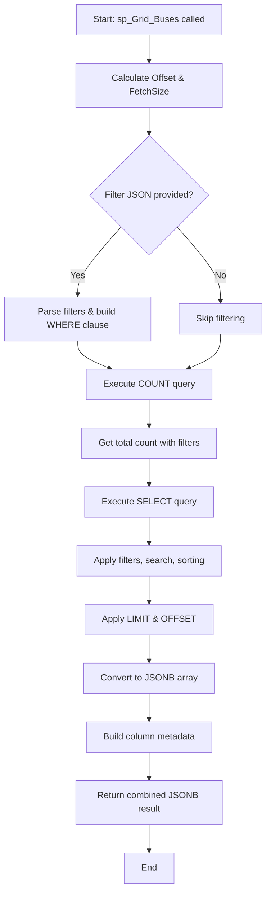

# sp_Grid_Buses Stored Procedure Explained

## Overview

`sp_Grid_Buses` is a PostgreSQL function that fetches bus data for the dynamic grid component. It's a **data-fetching procedure** that supports pagination, sorting, filtering, and global search - all the features needed for an interactive grid.

## Function Signature

```sql
CREATE OR REPLACE FUNCTION sp_Grid_Buses(
    p_PageNumber INT DEFAULT 1,           -- Current page number (1-indexed)
    p_PageSize INT DEFAULT 15,            -- Number of rows per page
    p_StartRow INT DEFAULT NULL,          -- Alternative: Start row for range-based pagination
    p_EndRow INT DEFAULT NULL,            -- Alternative: End row for range-based pagination
    p_SortColumn VARCHAR DEFAULT NULL,    -- Column to sort by
    p_SortDirection VARCHAR DEFAULT 'ASC',-- Sort direction: 'ASC' or 'DESC'
    p_FilterJson TEXT DEFAULT NULL,       -- JSON string with column filters
    p_SearchTerm VARCHAR DEFAULT NULL     -- Global search term
)
RETURNS JSONB
```

## Return Value

Returns a single JSONB object with this structure:

```json
{
  "rows": [...],           // Array of bus records
  "columns": [...],        // Column metadata (headers, types, widths)
  "totalCount": 1234,      // Total number of records (after filtering)
  "pageNumber": 1,         // Current page
  "pageSize": 15,          // Rows per page
  "totalPages": 83         // Total pages available
}
```

---

## Key Features

### 🔑 **1. Composite Key as Id Alias**

**The Most Important Part for Bus Table!**

```sql
SELECT 
    (b.ibus::TEXT || '_' || b."CaseNumber"::TEXT) AS "Id",  -- Composite key!
    b.ibus,
    b."CaseNumber",
    ...
```

**Why This Matters:**
- Bus table has a **composite primary key**: (`ibus`, `CaseNumber`)
- The grid needs a **single unique identifier** for each row
- We create a virtual `Id` field by concatenating: `"101_1"` (ibus=101, CaseNumber=1)
- This `Id` is used by the frontend for:
  - Row identification
  - Edit/Delete operations
  - State management

**Example:**
- Bus with `ibus=101` and `CaseNumber=1` → `Id = "101_1"`
- Bus with `ibus=205` and `CaseNumber=3` → `Id = "205_3"`

---

### 📊 **2. Pagination Logic**

```sql
-- Determine offset and fetch size
IF p_StartRow IS NOT NULL AND p_EndRow IS NOT NULL THEN
    v_Offset := p_StartRow - 1;
    v_FetchSize := p_EndRow - p_StartRow + 1;
ELSE
    v_Offset := (p_PageNumber - 1) * p_PageSize;
    v_FetchSize := p_PageSize;
END IF;
```

**Two Pagination Modes:**

**A. Page-Based (Standard)**
- Input: `p_PageNumber=2`, `p_PageSize=15`
- Calculation: `v_Offset = (2-1) * 15 = 15`, `v_FetchSize = 15`
- Result: Rows 16-30

**B. Range-Based (Alternative)**
- Input: `p_StartRow=21`, `p_EndRow=40`
- Calculation: `v_Offset = 20`, `v_FetchSize = 20`
- Result: Rows 21-40

---

### 🔍 **3. Global Search**

```sql
AND ($1 IS NULL OR 
     b.name ILIKE '%%' || $1 || '%%' OR
     CAST(b.ibus AS TEXT) ILIKE '%%' || $1 || '%%' OR
     CAST(b."CaseNumber" AS TEXT) ILIKE '%%' || $1 || '%%' OR
     CAST(b.baskv AS TEXT) ILIKE '%%' || $1 || '%%')
```

**How It Works:**
- Searches across multiple columns simultaneously
- Uses `ILIKE` for case-insensitive matching
- Converts numbers to text for searching
- `%%` is escaped to `%` in the final SQL (wildcard pattern)

**Example:**
- Search term: `"101"`
- Matches:
  - Bus with `ibus=101`
  - Bus with `name="Station 101"`
  - Bus with `baskv=101.5`

---

### 🎯 **4. Dynamic Column Filtering**

```sql
-- Parse filter JSON
v_FilterJson := p_FilterJson::JSONB;
v_FilterKeys := ARRAY(SELECT jsonb_object_keys(v_FilterJson));

FOREACH v_FilterKey IN ARRAY v_FilterKeys
LOOP
    v_FilterValue := v_FilterJson->v_FilterKey;
    v_FilterType := v_FilterValue->>'filterType';
    ...
END LOOP;
```

**Filter JSON Format:**
```json
{
  "baskv": {
    "filterType": "greaterThan",
    "filter": "100"
  },
  "name": {
    "filterType": "contains",
    "filter": "Station"
  }
}
```

**Text Filter Types:**
- `contains` → `name ILIKE '%Station%'`
- `notContains` → `name NOT ILIKE '%Station%'`
- `equals` → `name ILIKE 'Station'`
- `notEqual` → `name NOT ILIKE 'Station'`
- `startsWith` → `name ILIKE 'Station%'`
- `endsWith` → `name ILIKE '%Station'`

**Number Filter Types:**
- `equals` → `baskv = 100`
- `notEqual` → `baskv != 100`
- `lessThan` → `baskv < 100`
- `lessThanOrEqual` → `baskv <= 100`
- `greaterThan` → `baskv > 100`
- `greaterThanOrEqual` → `baskv >= 100`

**Dynamic WHERE Clause Building:**
```sql
-- Multiple filters are combined with AND
v_FilterWhere := 'b.baskv > 100 AND b.name ILIKE '%Station%''
```

---

### 📈 **5. Dynamic Sorting**

```sql
ORDER BY 
    CASE WHEN $2 = 'ibus' AND $3 = 'ASC' THEN b.ibus END ASC,
    CASE WHEN $2 = 'ibus' AND $3 = 'DESC' THEN b.ibus END DESC,
    CASE WHEN $2 = 'CaseNumber' AND $3 = 'ASC' THEN b."CaseNumber" END ASC,
    CASE WHEN $2 = 'CaseNumber' AND $3 = 'DESC' THEN b."CaseNumber" END DESC,
    CASE WHEN $2 = 'name' AND $3 = 'ASC' THEN b.name END ASC,
    CASE WHEN $2 = 'name' AND $3 = 'DESC' THEN b.name END DESC,
    ...
    b.ibus ASC  -- Default sort
```

**How It Works:**
- Uses `CASE` statements for each sortable column
- Only one `CASE` evaluates to non-NULL based on parameters
- PostgreSQL sorts by non-NULL values first
- Falls back to `ibus ASC` as default

**Example:**
- Input: `p_SortColumn='name'`, `p_SortDirection='DESC'`
- Result: Sorted by `name` descending

---

### 📋 **6. Column Metadata**

```sql
v_Columns := '[
    {"field": "actions", "headerName": "Actions", "width": 120, "sortable": false, "filter": false, "pinned": true},
    {"field": "ibus", "headerName": "Bus Number", "type": "number", "width": 120, "sortable": true, "filter": true, "editable": false},
    {"field": "CaseNumber", "headerName": "Case Number", "type": "number", "width": 130, "sortable": true, "filter": true, "editable": false},
    {"field": "name", "headerName": "Name", "type": "text", "width": 200, "sortable": true, "filter": true, "editable": true},
    ...
]'::JSONB;
```

**Column Properties:**
- `field`: Database column name
- `headerName`: Display name in grid header
- `type`: Data type (`text`, `number`, `date`)
- `width`: Column width in pixels
- `sortable`: Can user sort by this column?
- `filter`: Can user filter this column?
- `editable`: Can user edit this field?
- `pinned`: Keep column fixed (for actions)

**Key Fields:**
- `ibus`, `CaseNumber`: **Not editable** (primary key components)
- `name`, `baskv`, etc.: **Editable** fields
- `actions`: Special column for Edit/Delete buttons

---

## Execution Flow



---

## Example Usage

### **Simple Query (Page 1, 15 rows)**
```sql
SELECT sp_Grid_Buses(1, 15, NULL, NULL, NULL, 'ASC', NULL, NULL);
```

### **With Sorting**
```sql
SELECT sp_Grid_Buses(1, 15, NULL, NULL, 'baskv', 'DESC', NULL, NULL);
```

### **With Global Search**
```sql
SELECT sp_Grid_Buses(1, 15, NULL, NULL, NULL, 'ASC', NULL, 'Station');
```

### **With Column Filter**
```sql
SELECT sp_Grid_Buses(
    1, 15, NULL, NULL, NULL, 'ASC',
    '{"baskv": {"filterType": "greaterThan", "filter": "100"}}',
    NULL
);
```

### **Complete Example**
```sql
SELECT sp_Grid_Buses(
    2,                                                      -- Page 2
    20,                                                     -- 20 rows per page
    NULL, NULL,                                            -- Not using range-based
    'name',                                                -- Sort by name
    'ASC',                                                 -- Ascending
    '{"baskv": {"filterType": "greaterThan", "filter": "100"}}',  -- Filter: baskv > 100
    'Station'                                              -- Search: "Station"
);
```

---

## Key Differences from Employee Grid

### **Composite Key Handling**
```sql
-- Bus (Composite Key)
(b.ibus::TEXT || '_' || b."CaseNumber"::TEXT) AS "Id"

-- Employee (Simple Key)
e."Id" AS "Id"
```

### **Primary Key Editability**
```sql
-- Bus: Both key components are NOT editable
{"field": "ibus", "editable": false}
{"field": "CaseNumber", "editable": false}

-- Employee: Id is NOT editable
{"field": "Id", "editable": false}
```

---

## Performance Considerations

### **Indexed Columns**
For optimal performance, ensure indexes on:
- `ibus` (part of primary key)
- `CaseNumber` (part of primary key)
- `name` (frequently searched/sorted)
- `baskv` (frequently filtered/sorted)

### **Query Optimization**
- **COUNT query** runs first with same filters (for total count)
- **SELECT query** runs second with LIMIT/OFFSET (for current page)
- Both queries use the same WHERE clause for consistency

### **Dynamic SQL**
- Uses `EXECUTE format()` for dynamic WHERE clause injection
- Parameterized queries prevent SQL injection
- Filter conditions are built safely using `format()`

---

## Summary

The `sp_Grid_Buses` stored procedure is a **complete grid data provider** that:

✅ **Handles composite keys** by creating a virtual `Id` field
✅ **Supports pagination** (both page-based and range-based)
✅ **Enables global search** across multiple columns
✅ **Provides dynamic filtering** with multiple filter types
✅ **Allows flexible sorting** on any column
✅ **Returns column metadata** for grid configuration
✅ **Optimizes performance** with proper indexing and query structure

This makes it a perfect data source for the dynamic grid component, providing all necessary features while maintaining the generic nature of the frontend code!
