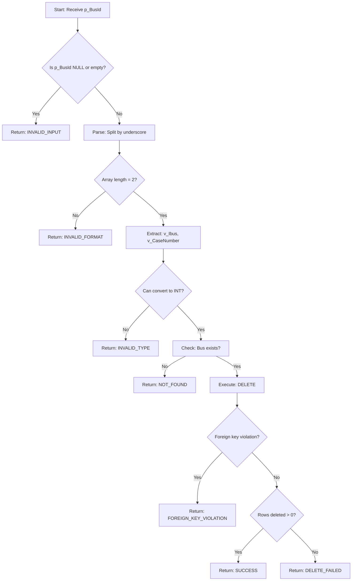

# sp_Grid_Delete_Bus Stored Procedure Explained

## Overview

`sp_Grid_Delete_Bus` is a PostgreSQL function that deletes a bus record from the `Bus` table. The key challenge is handling the **composite primary key** (`ibus`, `CaseNumber`) which is passed as a single concatenated TEXT parameter.

## Function Signature

```sql
CREATE OR REPLACE FUNCTION sp_Grid_Delete_Bus(
    p_BusId TEXT  -- Composite key in format: "ibus_CaseNumber" (e.g., "101_1")
)
RETURNS JSONB
```

### **Input Parameter**

| Parameter | Type | Example | Description |
|-----------|------|---------|-------------|
| `p_BusId` | TEXT | `"101_1"` | Composite key: `ibus=101`, `CaseNumber=1` |

### **Return Value**

Returns a JSONB object with success status and message:

**Success Response:**
```json
{
  "success": true,
  "message": "Bus deleted successfully"
}
```

**Error Response:**
```json
{
  "success": false,
  "message": "Error description",
  "errorCode": "ERROR_CODE"
}
```

---

## Execution Flow



---

## Step-by-Step Breakdown

### **Step 1: Input Validation**

```sql
-- Validate input
IF p_BusId IS NULL OR p_BusId = '' THEN
    RETURN jsonb_build_object(
        'success', false,
        'message', 'Bus ID is required',
        'errorCode', 'INVALID_INPUT'
    );
END IF;
```

**What It Does:**
- Checks if the input parameter is NULL or empty string
- Returns error immediately if invalid

**Example:**
- Input: `NULL` → Error: `INVALID_INPUT`
- Input: `""` → Error: `INVALID_INPUT`
- Input: `"101_1"` → Continue ✓

---

### **Step 2: Parse Composite Key**

```sql
-- Parse composite key (format: "ibus_CaseNumber")
v_Parts := string_to_array(p_BusId, '_');

IF array_length(v_Parts, 1) != 2 THEN
    RETURN jsonb_build_object(
        'success', false,
        'message', 'Invalid Bus ID format. Expected format: ibus_CaseNumber',
        'errorCode', 'INVALID_FORMAT'
    );
END IF;
```

**What It Does:**
- Splits the input string by underscore delimiter
- Validates that exactly 2 parts exist

**Example:**
- Input: `"101_1"` → `v_Parts = ["101", "1"]` ✓
- Input: `"101"` → Error: `INVALID_FORMAT` (only 1 part)
- Input: `"101_1_2"` → Error: `INVALID_FORMAT` (3 parts)

---

### **Step 3: Extract and Convert to Integers**

```sql
-- Extract ibus and CaseNumber
BEGIN
    v_Ibus := v_Parts[1]::INT;
    v_CaseNumber := v_Parts[2]::INT;
EXCEPTION WHEN OTHERS THEN
    RETURN jsonb_build_object(
        'success', false,
        'message', 'Invalid Bus ID values. Both ibus and CaseNumber must be integers',
        'errorCode', 'INVALID_TYPE'
    );
END;
```

**What It Does:**
- Converts string parts to integers
- Catches conversion errors (e.g., non-numeric values)

**Example:**
- Input: `"101_1"` → `v_Ibus=101`, `v_CaseNumber=1` ✓
- Input: `"ABC_1"` → Error: `INVALID_TYPE` (ABC is not a number)
- Input: `"101_XYZ"` → Error: `INVALID_TYPE` (XYZ is not a number)

---

### **Step 4: Check if Bus Exists**

```sql
-- Check if bus exists
SELECT COUNT(*) INTO v_RowCount
FROM "Bus"
WHERE ibus = v_Ibus AND "CaseNumber" = v_CaseNumber;

IF v_RowCount = 0 THEN
    RETURN jsonb_build_object(
        'success', false,
        'message', 'Bus not found',
        'errorCode', 'NOT_FOUND'
    );
END IF;
```

**What It Does:**
- Queries the database to verify the bus exists
- Prevents attempting to delete non-existent records

**Example:**
- Bus with `ibus=101`, `CaseNumber=1` exists → Continue ✓
- Bus with `ibus=999`, `CaseNumber=999` doesn't exist → Error: `NOT_FOUND`

---

### **Step 5: Delete the Bus**

```sql
-- Delete the bus
BEGIN
    DELETE FROM "Bus"
    WHERE ibus = v_Ibus AND "CaseNumber" = v_CaseNumber;
    
    GET DIAGNOSTICS v_RowCount = ROW_COUNT;
    
    IF v_RowCount > 0 THEN
        RETURN jsonb_build_object(
            'success', true,
            'message', 'Bus deleted successfully'
        );
    ELSE
        RETURN jsonb_build_object(
            'success', false,
            'message', 'Failed to delete bus',
            'errorCode', 'DELETE_FAILED'
        );
    END IF;
```

**What It Does:**
- Executes the DELETE statement
- Checks how many rows were affected
- Returns success if deletion occurred

**Example:**
- 1 row deleted → Success ✓
- 0 rows deleted → Error: `DELETE_FAILED` (shouldn't happen after existence check)

---

### **Step 6: Error Handling**

```sql
EXCEPTION
    WHEN foreign_key_violation THEN
        RETURN jsonb_build_object(
            'success', false,
            'message', 'Cannot delete bus: referenced by other records',
            'errorCode', 'FOREIGN_KEY_VIOLATION'
        );
    WHEN OTHERS THEN
        RETURN jsonb_build_object(
            'success', false,
            'message', 'Database error: ' || SQLERRM,
            'errorCode', 'DATABASE_ERROR'
        );
END;
```

**What It Does:**
- Catches foreign key constraint violations
- Catches any other unexpected database errors
- Returns descriptive error messages

**Example:**
- Bus is referenced by other tables → Error: `FOREIGN_KEY_VIOLATION`
- Database connection lost → Error: `DATABASE_ERROR`

---

## Error Codes Reference

| Error Code | Trigger Condition | User-Friendly Message |
|------------|-------------------|----------------------|
| `INVALID_INPUT` | NULL or empty `p_BusId` | "Bus ID is required" |
| `INVALID_FORMAT` | Wrong format (not `ibus_CaseNumber`) | "Invalid Bus ID format. Expected format: ibus_CaseNumber" |
| `INVALID_TYPE` | Non-integer values in composite key | "Invalid Bus ID values. Both ibus and CaseNumber must be integers" |
| `NOT_FOUND` | Bus doesn't exist in database | "Bus not found" |
| `DELETE_FAILED` | Delete executed but no rows affected | "Failed to delete bus" |
| `FOREIGN_KEY_VIOLATION` | Bus referenced by other tables | "Cannot delete bus: referenced by other records" |
| `DATABASE_ERROR` | Any other database error | "Database error: [details]" |

---

## Integration with Dynamic Grid Service

### **Frontend → Backend Flow**

```typescript
// 1. User clicks Delete button on bus row
// Frontend sends:
{
  "procedureName": "sp_Grid_Buses",
  "rowId": "101_1"  // Composite key as string
}

// 2. DynamicGridService.DeleteRowAsync receives request
// - Derives delete procedure: sp_Grid_Delete_Bus
// - Detects composite key (contains "_")
// - Creates TEXT parameter: p_BusId = "101_1"

// 3. Executes SQL:
SELECT sp_Grid_Delete_Bus(@p_BusId)

// 4. Returns response to frontend
{
  "success": true,
  "message": "Bus deleted successfully"
}
```

### **C# Service Code**

```csharp
// In DynamicGridService.DeleteRowAsync

// Detect composite key
if (rowIdString.Contains("_"))
{
    // Composite key format (e.g., "101_1") - use TEXT parameter
    parameterName = $"p_{entityName}Id";  // p_BusId
    parameter = new NpgsqlParameter(parameterName, NpgsqlDbType.Text) 
    { 
        Value = rowIdString  // "101_1"
    };
}

// Execute delete function
var sql = $"SELECT {deleteProcedureName}(@{parameterName})";
// SQL: SELECT sp_Grid_Delete_Bus(@p_BusId)
```

---

## Comparison: Bus vs Employee Delete

### **Bus (Composite Key)**

```sql
-- Input
p_BusId = "101_1"  -- TEXT

-- Parsing
v_Parts := string_to_array(p_BusId, '_');
v_Ibus := v_Parts[1]::INT;        -- 101
v_CaseNumber := v_Parts[2]::INT;  -- 1

-- Delete
DELETE FROM "Bus"
WHERE ibus = v_Ibus AND "CaseNumber" = v_CaseNumber;
```

### **Employee (Simple Integer Key)**

```sql
-- Input
p_EmployeeId = 123  -- INTEGER

-- No parsing needed

-- Delete
DELETE FROM "Employees"
WHERE "Id" = p_EmployeeId;
```

---

## Example Usage

### **Successful Deletion**
```sql
SELECT sp_Grid_Delete_Bus('101_1');
```

**Result:**
```json
{
  "success": true,
  "message": "Bus deleted successfully"
}
```

### **Bus Not Found**
```sql
SELECT sp_Grid_Delete_Bus('999_999');
```

**Result:**
```json
{
  "success": false,
  "message": "Bus not found",
  "errorCode": "NOT_FOUND"
}
```

### **Invalid Format**
```sql
SELECT sp_Grid_Delete_Bus('101');  -- Missing CaseNumber
```

**Result:**
```json
{
  "success": false,
  "message": "Invalid Bus ID format. Expected format: ibus_CaseNumber",
  "errorCode": "INVALID_FORMAT"
}
```

### **Foreign Key Violation**
```sql
-- If bus is referenced by other tables
SELECT sp_Grid_Delete_Bus('101_1');
```

**Result:**
```json
{
  "success": false,
  "message": "Cannot delete bus: referenced by other records",
  "errorCode": "FOREIGN_KEY_VIOLATION"
}
```

---

## Security Considerations

### **SQL Injection Prevention**
✅ **Safe:** Uses parameterized queries
```sql
WHERE ibus = v_Ibus AND "CaseNumber" = v_CaseNumber;
-- v_Ibus and v_CaseNumber are typed as INT
```

❌ **Unsafe (NOT used):**
```sql
-- DON'T DO THIS:
EXECUTE 'DELETE FROM "Bus" WHERE ibus = ' || p_BusId;
```

### **Input Validation**
- ✅ NULL check
- ✅ Format validation (must contain exactly one `_`)
- ✅ Type validation (both parts must be integers)
- ✅ Existence check (bus must exist before deletion)

---

## Performance Considerations

### **Indexed Lookup**
The composite primary key is automatically indexed:
```sql
-- Primary key constraint creates index
PRIMARY KEY (ibus, "CaseNumber")
```

**Query Performance:**
- Existence check: O(1) - index lookup
- Delete operation: O(1) - index lookup

### **Transaction Safety**
- Wrapped in exception handling
- Atomic operation (delete succeeds or fails completely)
- Foreign key constraints enforced

---

## Testing Scenarios

### **Valid Deletion**
```sql
-- Setup
INSERT INTO "Bus" (ibus, "CaseNumber", name, baskv) 
VALUES (101, 1, 'Test Bus', 138.0);

-- Test
SELECT sp_Grid_Delete_Bus('101_1');

-- Verify
SELECT * FROM "Bus" WHERE ibus = 101 AND "CaseNumber" = 1;
-- Should return 0 rows
```

### **Invalid Format**
```sql
SELECT sp_Grid_Delete_Bus('invalid');
SELECT sp_Grid_Delete_Bus('101');
SELECT sp_Grid_Delete_Bus('101_1_2');
-- All should return INVALID_FORMAT error
```

### **Non-Integer Values**
```sql
SELECT sp_Grid_Delete_Bus('ABC_XYZ');
SELECT sp_Grid_Delete_Bus('101_ABC');
-- Should return INVALID_TYPE error
```

---

## Summary

The `sp_Grid_Delete_Bus` stored procedure is a **robust delete handler** that:

✅ **Handles composite keys** by parsing the concatenated format
✅ **Validates input** at multiple levels (NULL, format, type, existence)
✅ **Prevents errors** with comprehensive error handling
✅ **Protects data integrity** with foreign key violation detection
✅ **Returns clear feedback** with success/error messages and codes
✅ **Integrates seamlessly** with the generic dynamic grid service

**Key Innovation:** The composite key parsing allows the frontend to remain generic while the stored procedure handles the table-specific complexity of multi-column primary keys!
