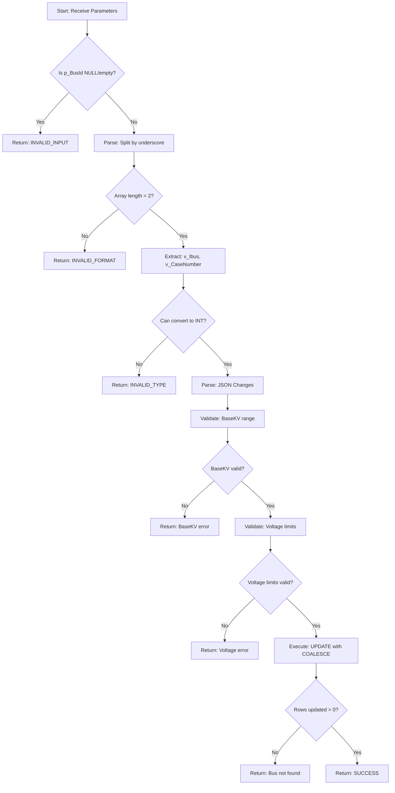

# sp_Grid_Update_Bus Stored Procedure Explained

## Overview

`sp_Grid_Update_Bus` is a PostgreSQL function that updates bus records in the `Bus` table. It handles the **composite primary key** (`ibus`, `CaseNumber`) and supports **partial updates** - only the fields that changed are updated, leaving others untouched.

## Function Signature

```sql
CREATE OR REPLACE FUNCTION sp_Grid_Update_Bus(
    p_BusId TEXT,        -- Composite key: "ibus_CaseNumber" (e.g., "101_1")
    p_ChangesJson TEXT,  -- JSON with changed fields only
    p_UserId INT         -- User making the change (for audit)
)
RETURNS JSONB
```

### **Input Parameters**

| Parameter | Type | Example | Description |
|-----------|------|---------|-------------|
| `p_BusId` | TEXT | `"101_1"` | Composite key: `ibus=101`, `CaseNumber=1` |
| `p_ChangesJson` | TEXT | `{"name":"New Name","baskv":"138.5"}` | JSON with only changed fields |
| `p_UserId` | INT | `5` | ID of user making the update |

### **Return Value**

**Success Response:**
```json
{
  "success": true,
  "message": "Bus updated successfully"
}
```

**Error Response:**
```json
{
  "success": false,
  "message": "Error description"
}
```

---

## Execution Flow



---

## Step-by-Step Breakdown

### **Step 1: Composite Key Parsing**

```sql
-- Validate input
IF p_BusId IS NULL OR p_BusId = '' THEN
    RETURN jsonb_build_object(
        'success', false,
        'message', 'Bus ID is required',
        'errorCode', 'INVALID_INPUT'
    );
END IF;

-- Parse composite key
v_Parts := string_to_array(p_BusId, '_');

IF array_length(v_Parts, 1) != 2 THEN
    RETURN jsonb_build_object(
        'success', false,
        'message', 'Invalid Bus ID format. Expected format: ibus_CaseNumber',
        'errorCode', 'INVALID_FORMAT'
    );
END IF;

-- Extract and convert
v_Ibus := v_Parts[1]::INT;
v_CaseNumber := v_Parts[2]::INT;
```

**Same as Delete Procedure!**
- Input: `"101_1"` → `v_Ibus=101`, `v_CaseNumber=1`
- Validates format and type

---

### **Step 2: Parse JSON Changes**

```sql
-- Parse JSON changes
v_Name := (p_ChangesJson::jsonb)->>'name';
v_BaseKV := ((p_ChangesJson::jsonb)->>'baskv')::DECIMAL;
v_Area := ((p_ChangesJson::jsonb)->>'iarea')::INT;
v_Zone := ((p_ChangesJson::jsonb)->>'zone')::INT;
v_Owner := ((p_ChangesJson::jsonb)->>'iowner')::INT;
v_IDE := ((p_ChangesJson::jsonb)->>'ide')::INT;
v_VM := ((p_ChangesJson::jsonb)->>'vm')::DECIMAL;
v_VA := ((p_ChangesJson::jsonb)->>'va')::DECIMAL;
v_NVHi := ((p_ChangesJson::jsonb)->>'nvhi')::DECIMAL;
v_NVLo := ((p_ChangesJson::jsonb)->>'nvlo')::DECIMAL;
v_EVHi := ((p_ChangesJson::jsonb)->>'evhi')::DECIMAL;
v_EVLo := ((p_ChangesJson::jsonb)->>'evlo')::DECIMAL;
v_Izone := ((p_ChangesJson::jsonb)->>'Izone')::INT;
v_AreaCaseNumber := ((p_ChangesJson::jsonb)->>'AreaCaseNumber')::INT;
v_OwnerCaseNumber := ((p_ChangesJson::jsonb)->>'OwnerCaseNumber')::INT;
v_ZoneCaseNumber := ((p_ChangesJson::jsonb)->>'ZoneCaseNumber')::INT;
```

**How It Works:**
- Extracts each field from JSON
- Converts to appropriate type (TEXT, INT, DECIMAL)
- If field not in JSON, variable is NULL

**Example Input:**
```json
{
  "name": "Station Alpha",
  "baskv": "138.5"
}
```

**Result:**
- `v_Name = "Station Alpha"`
- `v_BaseKV = 138.5`
- `v_Area = NULL` (not in JSON)
- `v_Zone = NULL` (not in JSON)
- ... all other fields = NULL

---

### **Step 3: Validate BaseKV Range**

```sql
-- Validate BaseKV if provided
IF v_BaseKV IS NOT NULL AND (v_BaseKV < 0 OR v_BaseKV > 1000) THEN
    RETURN jsonb_build_object(
        'success', false,
        'message', 'Base KV must be between 0 and 1000'
    );
END IF;
```

**Validation Rule:**
- **Range**: 0 ≤ BaseKV ≤ 1000
- **Only validates if provided** (NULL is OK)

**Examples:**
- `baskv = 138.5` → Valid ✓
- `baskv = 500` → Valid ✓
- `baskv = -10` → Error ❌
- `baskv = 1500` → Error ❌
- `baskv = NULL` → Valid ✓ (not provided)

---

### **Step 4: Validate Voltage Limits**

```sql
-- Validate normal voltage limits
IF v_NVHi IS NOT NULL AND v_NVLo IS NOT NULL AND v_NVHi < v_NVLo THEN
    RETURN jsonb_build_object(
        'success', false,
        'message', 'Normal voltage high must be greater than normal voltage low'
    );
END IF;

-- Validate emergency voltage limits
IF v_EVHi IS NOT NULL AND v_EVLo IS NOT NULL AND v_EVHi < v_EVLo THEN
    RETURN jsonb_build_object(
        'success', false,
        'message', 'Emergency voltage high must be greater than emergency voltage low'
    );
END IF;
```

**Validation Rules:**
- **Normal Voltage**: `nvhi` must be > `nvlo`
- **Emergency Voltage**: `evhi` must be > `evlo`
- **Only validates if BOTH values provided**

**Examples:**

**Normal Voltage:**
- `nvhi=1.05`, `nvlo=0.95` → Valid ✓
- `nvhi=0.95`, `nvlo=1.05` → Error ❌
- `nvhi=1.05`, `nvlo=NULL` → Valid ✓ (only one provided)

**Emergency Voltage:**
- `evhi=1.10`, `evlo=0.90` → Valid ✓
- `evhi=0.90`, `evlo=1.10` → Error ❌

---

### **Step 5: Partial Update with COALESCE**

```sql
UPDATE "Bus"
SET 
    name = COALESCE(v_Name, name),
    baskv = COALESCE(v_BaseKV, baskv),
    iarea = COALESCE(v_Area, iarea),
    zone = COALESCE(v_Zone, zone),
    iowner = COALESCE(v_Owner, iowner),
    ide = COALESCE(v_IDE, ide),
    vm = COALESCE(v_VM, vm),
    va = COALESCE(v_VA, va),
    nvhi = COALESCE(v_NVHi, nvhi),
    nvlo = COALESCE(v_NVLo, nvlo),
    evhi = COALESCE(v_EVHi, evhi),
    evlo = COALESCE(v_EVLo, evlo),
    "Izone" = COALESCE(v_Izone, "Izone"),
    "AreaCaseNumber" = COALESCE(v_AreaCaseNumber, "AreaCaseNumber"),
    "OwnerCaseNumber" = COALESCE(v_OwnerCaseNumber, "OwnerCaseNumber"),
    "ZoneCaseNumber" = COALESCE(v_ZoneCaseNumber, "ZoneCaseNumber")
WHERE ibus = v_Ibus AND "CaseNumber" = v_CaseNumber;
```

**COALESCE Magic:**
```sql
COALESCE(v_Name, name)
```
- If `v_Name` is NOT NULL → Use new value
- If `v_Name` is NULL → Keep existing value

**Example:**

**Before Update:**
```
ibus=101, CaseNumber=1, name="Old Name", baskv=138.0, iarea=5
```

**Changes JSON:**
```json
{
  "name": "New Name",
  "baskv": "230.0"
}
```

**After Update:**
```
ibus=101, CaseNumber=1, name="New Name", baskv=230.0, iarea=5
```

**Result:**
- ✅ `name` updated (was in JSON)
- ✅ `baskv` updated (was in JSON)
- ✅ `iarea` unchanged (not in JSON)
- ✅ `ibus`, `CaseNumber` unchanged (primary key)

---

### **Step 6: Check Update Success**

```sql
GET DIAGNOSTICS v_UpdateCount = ROW_COUNT;

IF v_UpdateCount = 0 THEN
    RETURN jsonb_build_object(
        'success', false,
        'message', 'Bus not found with ID: ' || p_BusId
    );
END IF;

RETURN jsonb_build_object(
    'success', true,
    'message', 'Bus updated successfully'
);
```

**What It Does:**
- Checks how many rows were affected
- 0 rows = Bus doesn't exist
- 1 row = Success

---

## Integration with Dynamic Grid Service

### **Frontend → Backend Flow**

```typescript
// 1. User edits bus fields and clicks Save
// Frontend sends:
{
  "procedureName": "sp_Grid_Buses",
  "rowId": "101_1",  // Composite key
  "changes": {
    "name": "New Station Name",
    "baskv": "138.5"
  },
  "userId": 5
}

// 2. DynamicGridService.UpdateRowAsync receives request
// - Derives update procedure: sp_Grid_Update_Bus
// - Detects composite key (contains "_")
// - Creates TEXT parameter: p_BusId = "101_1"
// - Serializes changes to JSON

// 3. Executes SQL:
SELECT sp_Grid_Update_Bus(
    @p_BusId,        -- "101_1"
    @p_ChangesJson,  -- '{"name":"New Station Name","baskv":"138.5"}'
    @p_UserId        -- 5
)

// 4. Returns response
{
  "success": true,
  "message": "Bus updated successfully"
}
```

### **C# Service Code**

```csharp
// In DynamicGridService.UpdateRowAsync

// Serialize changes
var changesJson = JsonSerializer.Serialize(request.Changes);
// Result: '{"name":"New Station Name","baskv":"138.5"}'

// Detect composite key
if (rowIdString.Contains("_"))
{
    // Composite key - use TEXT parameter
    parameterName = $"p_{entityName}Id";  // p_BusId
    idParameter = new NpgsqlParameter(parameterName, NpgsqlDbType.Text) 
    { 
        Value = rowIdString  // "101_1"
    };
}

// Execute update
var sql = $"SELECT {updateProcedureName}(@{parameterName}, @p_ChangesJson, @p_UserId)";
// SQL: SELECT sp_Grid_Update_Bus(@p_BusId, @p_ChangesJson, @p_UserId)
```

---

## Validation Rules Summary

| Field | Validation | Error Message |
|-------|------------|---------------|
| `p_BusId` | Not NULL/empty | "Bus ID is required" |
| `p_BusId` | Format: `ibus_CaseNumber` | "Invalid Bus ID format" |
| `p_BusId` | Both parts are integers | "Invalid Bus ID values" |
| `baskv` | 0 ≤ value ≤ 1000 | "Base KV must be between 0 and 1000" |
| `nvhi`, `nvlo` | nvhi > nvlo | "Normal voltage high must be greater than normal voltage low" |
| `evhi`, `evlo` | evhi > evlo | "Emergency voltage high must be greater than emergency voltage low" |

---

## Editable vs Non-Editable Fields

### **Non-Editable (Primary Key)**
```sql
-- These are NEVER updated
ibus          -- Part of composite key
"CaseNumber"  -- Part of composite key
```

### **Editable Fields**
```sql
-- All these can be updated
name, baskv, iarea, zone, iowner, ide, vm, va,
nvhi, nvlo, evhi, evlo, "Izone", 
"AreaCaseNumber", "OwnerCaseNumber", "ZoneCaseNumber"
```

---

## Example Usage

### **Update Single Field**
```sql
SELECT sp_Grid_Update_Bus(
    '101_1',
    '{"name":"New Station Name"}',
    5
);
```

**Result:**
- Only `name` is updated
- All other fields remain unchanged

### **Update Multiple Fields**
```sql
SELECT sp_Grid_Update_Bus(
    '101_1',
    '{"name":"Alpha Station","baskv":"230.0","iarea":"10"}',
    5
);
```

**Result:**
- `name` → "Alpha Station"
- `baskv` → 230.0
- `iarea` → 10
- Other fields unchanged

### **Validation Error: BaseKV Out of Range**
```sql
SELECT sp_Grid_Update_Bus(
    '101_1',
    '{"baskv":"1500"}',
    5
);
```

**Result:**
```json
{
  "success": false,
  "message": "Base KV must be between 0 and 1000"
}
```

### **Validation Error: Voltage Limits**
```sql
SELECT sp_Grid_Update_Bus(
    '101_1',
    '{"nvhi":"0.95","nvlo":"1.05"}',
    5
);
```

**Result:**
```json
{
  "success": false,
  "message": "Normal voltage high must be greater than normal voltage low"
}
```

### **Bus Not Found**
```sql
SELECT sp_Grid_Update_Bus(
    '999_999',
    '{"name":"Test"}',
    5
);
```

**Result:**
```json
{
  "success": false,
  "message": "Bus not found with ID: 999_999"
}
```

---

## Comparison: Bus vs Employee Update

### **Bus (Composite Key)**

```sql
-- Input
p_BusId = "101_1"  -- TEXT
p_ChangesJson = '{"name":"New Name","baskv":"138.5"}'

-- Parsing
v_Parts := string_to_array(p_BusId, '_');
v_Ibus := v_Parts[1]::INT;
v_CaseNumber := v_Parts[2]::INT;

-- Update
UPDATE "Bus"
SET name = COALESCE(v_Name, name),
    baskv = COALESCE(v_BaseKV, baskv),
    ...
WHERE ibus = v_Ibus AND "CaseNumber" = v_CaseNumber;
```

### **Employee (Simple Integer Key)**

```sql
-- Input
p_Id = 123  -- INTEGER
p_ChangesJson = '{"FullName":"John Doe","Salary":"75000"}'

-- No parsing needed

-- Update
UPDATE "Employees"
SET "FirstName" = COALESCE(v_FirstName, "FirstName"),
    "Salary" = COALESCE(v_Salary, "Salary"),
    ...
WHERE "Id" = p_Id;
```

---

## Field Type Reference

### **Text Fields**
```sql
v_Name := (p_ChangesJson::jsonb)->>'name';
-- No type conversion needed
```

### **Integer Fields**
```sql
v_Area := ((p_ChangesJson::jsonb)->>'iarea')::INT;
-- Convert from TEXT to INT
```

### **Decimal Fields**
```sql
v_BaseKV := ((p_ChangesJson::jsonb)->>'baskv')::DECIMAL;
-- Convert from TEXT to DECIMAL
```

---

## Partial Update Benefits

### **Efficiency**
- Only changed fields are sent
- Reduces network payload
- Faster processing

### **Safety**
- Unchanged fields remain untouched
- No risk of accidentally clearing values
- Preserves data integrity

### **Example Scenario**

**User edits only the name:**

**Without Partial Update (Bad):**
```json
{
  "name": "New Name",
  "baskv": "138.0",
  "iarea": "5",
  "zone": "2",
  ... // All 16 fields
}
```

**With Partial Update (Good):**
```json
{
  "name": "New Name"
}
```

**Result:** Only 1 field sent instead of 16!

---

## Error Handling

```sql
EXCEPTION
    WHEN OTHERS THEN
        RETURN jsonb_build_object(
            'success', false,
            'message', 'Error: ' || SQLERRM
        );
END;
```

**Catches:**
- Type conversion errors
- Database errors
- Unexpected exceptions

**Returns:**
- Detailed error message with `SQLERRM` (SQL Error Message)

---

## Testing Scenarios

### **Valid Update**
```sql
-- Setup
INSERT INTO "Bus" (ibus, "CaseNumber", name, baskv) 
VALUES (101, 1, 'Old Name', 138.0);

-- Test
SELECT sp_Grid_Update_Bus('101_1', '{"name":"New Name"}', 5);

-- Verify
SELECT name FROM "Bus" WHERE ibus = 101 AND "CaseNumber" = 1;
-- Should return: "New Name"
```

### **Validation Failure**
```sql
SELECT sp_Grid_Update_Bus('101_1', '{"baskv":"2000"}', 5);
-- Should return error: "Base KV must be between 0 and 1000"
```

### **Partial Update**
```sql
-- Before: name="Station A", baskv=138.0, iarea=5
SELECT sp_Grid_Update_Bus('101_1', '{"baskv":"230.0"}', 5);
-- After: name="Station A", baskv=230.0, iarea=5
-- Only baskv changed!
```

---

## Summary

The `sp_Grid_Update_Bus` stored procedure is a **robust update handler** that:

✅ **Handles composite keys** by parsing the concatenated format
✅ **Supports partial updates** using COALESCE for efficiency
✅ **Validates business rules** (BaseKV range, voltage limits)
✅ **Preserves data integrity** by only updating provided fields
✅ **Provides clear feedback** with success/error messages
✅ **Integrates seamlessly** with the generic dynamic grid service
✅ **Prevents invalid data** with comprehensive validation

**Key Innovation:** The combination of composite key parsing and partial updates allows the frontend to remain generic while the stored procedure handles table-specific validation and multi-column primary keys!
