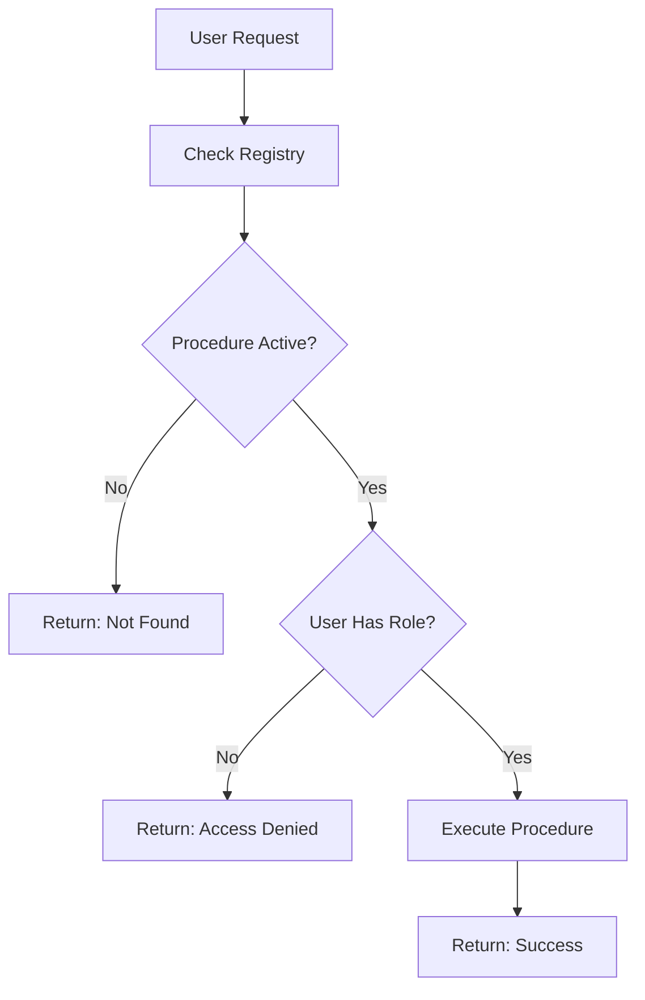

# StoredProcedureRegistry Table Documentation

## Overview

The `StoredProcedureRegistry` table is the **central registry** for all stored procedures used in the dynamic grid system. It serves as a metadata repository that controls:

- **Procedure Discovery** - Which procedures are available to users
- **Access Control** - Role-based permissions for each procedure
- **Grid Configuration** - Default pagination settings
- **Procedure Metadata** - Display names, descriptions, categories

## Purpose

### **Why Do We Need This Table?**

1. **Security** - Control who can execute which procedures
2. **Discovery** - Populate dropdown lists with available grids
3. **Configuration** - Store procedure-specific settings
4. **Auditing** - Track when procedures were created/updated
5. **Multi-tenancy** - Support client-specific procedures (future)

---

## Table Schema

```sql
CREATE TABLE "StoredProcedureRegistry" (
    "Id" SERIAL PRIMARY KEY,
    "ProcedureName" VARCHAR(200) NOT NULL UNIQUE,
    "DisplayName" VARCHAR(100) NOT NULL,
    "Description" VARCHAR(500),
    "ClientId" INT,
    "Category" VARCHAR(50),
    "IsActive" BOOLEAN NOT NULL DEFAULT true,
    "RequiresAuth" BOOLEAN NOT NULL DEFAULT true,
    "AllowedRoles" TEXT NOT NULL DEFAULT '[]',
    "CacheDurationSeconds" INT,
    "DefaultPageSize" INT NOT NULL DEFAULT 15,
    "MaxPageSize" INT NOT NULL DEFAULT 1000,
    "CreatedAt" TIMESTAMP NOT NULL DEFAULT NOW(),
    "UpdatedAt" TIMESTAMP,
    "CreatedBy" INT,
    "UpdatedBy" INT
);
```

---

## Field Descriptions

### **Core Identification**

#### **Id** (Primary Key)
- **Type**: `SERIAL` (Auto-increment integer)
- **Purpose**: Unique identifier for each registry entry
- **Example**: `1, 2, 3, ...`

#### **ProcedureName** (Required, Unique)
- **Type**: `VARCHAR(200)`
- **Purpose**: Exact name of the PostgreSQL function
- **Constraint**: Must match the actual function name in database
- **Examples**:
  - `sp_Grid_Buses`
  - `sp_Grid_Delete_Bus`
  - `sp_Grid_Update_Bus`
  - `sp_Grid_Example_Employees`

**⚠️ Critical:** This must exactly match the function name!

---

### **Display Information**

#### **DisplayName** (Required)
- **Type**: `VARCHAR(100)`
- **Purpose**: User-friendly name shown in UI
- **Examples**:
  - `"Bus Grid"`
  - `"Delete Bus"`
  - `"Update Bus"`
  - `"Example Employees"`

#### **Description** (Optional)
- **Type**: `VARCHAR(500)`
- **Purpose**: Detailed description of what the procedure does
- **Examples**:
  - `"View and manage bus data from the power system"`
  - `"Delete a bus record from the Bus table"`
  - `"Update bus record fields"`

#### **Category** (Optional)
- **Type**: `VARCHAR(50)`
- **Purpose**: Group procedures by functional area
- **Examples**:
  - `"Power System"`
  - `"Employee Management"`
  - `"HR"`
  - `"Finance"`

**Usage:** Helps organize procedures in dropdown menus

---

### **Access Control**

#### **IsActive** (Required)
- **Type**: `BOOLEAN`
- **Default**: `true`
- **Purpose**: Enable/disable procedure without deleting it
- **Values**:
  - `true` - Procedure is available
  - `false` - Procedure is hidden/disabled

**Use Case:** Temporarily disable a procedure during maintenance

#### **RequiresAuth** (Required)
- **Type**: `BOOLEAN`
- **Default**: `true`
- **Purpose**: Whether authentication is required
- **Values**:
  - `true` - User must be logged in
  - `false` - Public access (rarely used)

#### **AllowedRoles** (Required)
- **Type**: `TEXT` (JSON array)
- **Default**: `'[]'`
- **Purpose**: List of roles that can execute this procedure
- **Format**: JSON array of strings
- **Examples**:
  - `'["Admin"]'` - Only admins
  - `'["Admin", "Manager"]'` - Admins and managers
  - `'["Admin", "Manager", "User"]'` - All authenticated users

**How It Works:**
```csharp
// In DynamicGridService
var allowedRoles = JsonSerializer.Deserialize<List<string>>(proc.AllowedRoles);
if (userRoles.Any(role => allowedRoles.Contains(role)))
{
    // User has access
}
```

---

### **Multi-Tenancy (Future)**

#### **ClientId** (Optional)
- **Type**: `INT`
- **Purpose**: Support client-specific procedures in multi-tenant scenarios
- **Current Usage**: Not implemented yet
- **Future Use**: Filter procedures by client/organization

---

### **Performance & Caching**

#### **CacheDurationSeconds** (Optional)
- **Type**: `INT`
- **Purpose**: How long to cache procedure results
- **Current Usage**: Not implemented yet
- **Future Use**: Cache grid data for X seconds
- **Example**: `300` (5 minutes)

---

### **Pagination Settings**

#### **DefaultPageSize** (Required)
- **Type**: `INT`
- **Default**: `15`
- **Purpose**: Default number of rows per page
- **Examples**:
  - Grid procedures: `15`, `20`, `25`
  - Update/Delete procedures: `1` (not used for pagination)

#### **MaxPageSize** (Required)
- **Type**: `INT`
- **Default**: `1000`
- **Purpose**: Maximum rows allowed per page
- **Examples**:
  - Grid procedures: `1000`, `5000`
  - Update/Delete procedures: `1` (not used for pagination)

**Why Set for Update/Delete?**
- Required by schema (NOT NULL constraint)
- Set to `1` as placeholder
- Not actually used in CRUD operations

---

### **Audit Fields**

#### **CreatedAt** (Required)
- **Type**: `TIMESTAMP`
- **Default**: `NOW()`
- **Purpose**: When the procedure was registered

#### **UpdatedAt** (Optional)
- **Type**: `TIMESTAMP`
- **Purpose**: When the registration was last updated

#### **CreatedBy** (Optional)
- **Type**: `INT`
- **Purpose**: User ID who registered the procedure

#### **UpdatedBy** (Optional)
- **Type**: `INT`
- **Purpose**: User ID who last updated the registration

---

## Registration Examples

### **Grid Procedure (Data Fetching)**

```sql
INSERT INTO "StoredProcedureRegistry" (
    "ProcedureName",
    "DisplayName",
    "Description",
    "Category",
    "IsActive",
    "RequiresAuth",
    "AllowedRoles",
    "DefaultPageSize",
    "MaxPageSize",
    "CreatedAt",
    "UpdatedAt"
)
VALUES (
    'sp_Grid_Buses',                                    -- Exact function name
    'Bus Grid',                                         -- User-friendly name
    'View and manage bus data from the power system',   -- Description
    'Power System',                                     -- Category
    true,                                               -- Active
    true,                                               -- Requires authentication
    '["Admin", "Manager", "User"]'::jsonb,             -- All authenticated users
    15,                                                 -- 15 rows per page
    1000,                                               -- Max 1000 rows per page
    NOW(),
    NOW()
)
ON CONFLICT ("ProcedureName") DO UPDATE SET
    "IsActive" = true,
    "UpdatedAt" = NOW();
```

### **Delete Procedure (CRUD Helper)**

```sql
INSERT INTO "StoredProcedureRegistry" (
    "ProcedureName",
    "DisplayName",
    "Description",
    "Category",
    "IsActive",
    "RequiresAuth",
    "AllowedRoles",
    "DefaultPageSize",
    "MaxPageSize",
    "CreatedAt",
    "UpdatedAt"
)
VALUES (
    'sp_Grid_Delete_Bus',                               -- Exact function name
    'Delete Bus',                                       -- User-friendly name
    'Delete a bus record from the Bus table',           -- Description
    'Power System',                                     -- Category
    true,                                               -- Active
    true,                                               -- Requires authentication
    '["Admin", "Manager"]'::jsonb,                     -- Only admins and managers
    1,                                                  -- Not used (placeholder)
    1,                                                  -- Not used (placeholder)
    NOW(),
    NOW()
)
ON CONFLICT ("ProcedureName") DO UPDATE SET
    "IsActive" = true,
    "UpdatedAt" = NOW();
```

**Note:** Delete procedures have restricted roles (no "User" role)

### **Update Procedure (CRUD Helper)**

```sql
INSERT INTO "StoredProcedureRegistry" (
    "ProcedureName",
    "DisplayName",
    "Description",
    "Category",
    "IsActive",
    "RequiresAuth",
    "AllowedRoles",
    "DefaultPageSize",
    "MaxPageSize",
    "CreatedAt",
    "UpdatedAt"
)
VALUES (
    'sp_Grid_Update_Bus',                               -- Exact function name
    'Update Bus',                                       -- User-friendly name
    'Update a bus record in the Bus table',             -- Description
    'Power System',                                     -- Category
    true,                                               -- Active
    true,                                               -- Requires authentication
    '["Admin", "Manager"]'::jsonb,                     -- Only admins and managers
    1,                                                  -- Not used (placeholder)
    1,                                                  -- Not used (placeholder)
    NOW(),
    NOW()
)
ON CONFLICT ("ProcedureName") DO UPDATE SET
    "IsActive" = true,
    "UpdatedAt" = NOW();
```

---

## Role-Based Access Control

### **Common Role Patterns**

| Procedure Type | Typical Roles | Reasoning |
|----------------|---------------|-----------|
| **Grid (Read)** | `["Admin", "Manager", "User"]` | Everyone can view data |
| **Update** | `["Admin", "Manager"]` | Only privileged users can edit |
| **Delete** | `["Admin", "Manager"]` | Only privileged users can delete |
| **Admin-Only** | `["Admin"]` | Sensitive operations |

### **Example Scenarios**

**Scenario 1: Public Grid, Restricted Editing**
```sql
-- Grid: Everyone can view
'sp_Grid_Buses' → '["Admin", "Manager", "User"]'

-- Update: Only managers can edit
'sp_Grid_Update_Bus' → '["Admin", "Manager"]'

-- Delete: Only admins can delete
'sp_Grid_Delete_Bus' → '["Admin"]'
```

**Scenario 2: Fully Restricted**
```sql
-- All operations require Admin role
'sp_Grid_SensitiveData' → '["Admin"]'
'sp_Grid_Update_SensitiveData' → '["Admin"]'
'sp_Grid_Delete_SensitiveData' → '["Admin"]'
```

---

## Integration with DynamicGridService

### **1. Procedure Discovery (Dropdown)**

```csharp
public async Task<List<StoredProcedureInfo>> GetAvailableProceduresAsync(string[] userRoles)
{
    var procedures = await _context.StoredProcedureRegistry
        .Where(p => p.IsActive)  // Only active procedures
        .ToListAsync();

    foreach (var proc in procedures)
    {
        // Skip CRUD helper procedures
        if (proc.ProcedureName.Contains("_Update_") || 
            proc.ProcedureName.Contains("_Delete_"))
        {
            continue;  // Don't show in dropdown
        }
        
        // Check role access
        var allowedRoles = JsonSerializer.Deserialize<List<string>>(proc.AllowedRoles);
        if (userRoles.Any(role => allowedRoles.Contains(role)))
        {
            availableProcedures.Add(proc);  // User has access
        }
    }
    
    return availableProcedures;
}
```

**Result:** Dropdown shows only grid procedures user has access to

### **2. Access Validation**

```csharp
public async Task<bool> ValidateProcedureAccessAsync(string procedureName, string[] userRoles)
{
    var procedure = await _context.StoredProcedureRegistry
        .FirstOrDefaultAsync(p => p.ProcedureName == procedureName && p.IsActive);

    if (procedure == null)
    {
        return false;  // Procedure not found or inactive
    }

    var allowedRoles = JsonSerializer.Deserialize<List<string>>(procedure.AllowedRoles);
    return userRoles.Any(role => allowedRoles.Contains(role));
}
```

**Used For:**
- Grid data fetching
- Update operations
- Delete operations

### **3. Procedure Execution Flow**



---

## Query Examples

### **Get All Active Grid Procedures**
```sql
SELECT "ProcedureName", "DisplayName", "Category", "AllowedRoles"
FROM "StoredProcedureRegistry"
WHERE "IsActive" = true
  AND "ProcedureName" NOT LIKE '%_Update_%'
  AND "ProcedureName" NOT LIKE '%_Delete_%'
ORDER BY "Category", "DisplayName";
```

### **Get Procedures for a Specific Role**
```sql
SELECT "ProcedureName", "DisplayName", "Category"
FROM "StoredProcedureRegistry"
WHERE "IsActive" = true
  AND "AllowedRoles"::jsonb ? 'Manager'  -- Check if 'Manager' exists in array
ORDER BY "Category", "DisplayName";
```

### **Get All Procedures in a Category**
```sql
SELECT "ProcedureName", "DisplayName", "AllowedRoles"
FROM "StoredProcedureRegistry"
WHERE "IsActive" = true
  AND "Category" = 'Power System'
ORDER BY "DisplayName";
```

### **Disable a Procedure**
```sql
UPDATE "StoredProcedureRegistry"
SET "IsActive" = false,
    "UpdatedAt" = NOW()
WHERE "ProcedureName" = 'sp_Grid_Buses';
```

### **Update Allowed Roles**
```sql
UPDATE "StoredProcedureRegistry"
SET "AllowedRoles" = '["Admin"]'::jsonb,
    "UpdatedAt" = NOW()
WHERE "ProcedureName" = 'sp_Grid_Delete_Bus';
```

---

## Best Practices

### **✅ DO**

1. **Use Descriptive Names**
   ```sql
   DisplayName: "Bus Grid" (Good)
   DisplayName: "sp_Grid_Buses" (Bad - too technical)
   ```

2. **Set Appropriate Roles**
   ```sql
   Grid: ["Admin", "Manager", "User"]  -- Read access for all
   Delete: ["Admin", "Manager"]        -- Restricted write access
   ```

3. **Use Categories**
   ```sql
   Category: "Power System"  -- Groups related procedures
   ```

4. **Keep Descriptions Clear**
   ```sql
   Description: "View and manage bus data from the power system"
   ```

5. **Use ON CONFLICT for Idempotency**
   ```sql
   ON CONFLICT ("ProcedureName") DO UPDATE SET
       "IsActive" = true,
       "UpdatedAt" = NOW();
   ```

### **❌ DON'T**

1. **Don't Hardcode Procedure Names in Code**
   ```csharp
   // Bad
   if (procedureName == "sp_Grid_Buses") { ... }
   
   // Good
   var proc = await GetProcedureByName(procedureName);
   ```

2. **Don't Forget to Register CRUD Procedures**
   ```sql
   -- Register all three:
   sp_Grid_Buses         ✓
   sp_Grid_Update_Bus    ✓
   sp_Grid_Delete_Bus    ✓
   ```

3. **Don't Use Empty AllowedRoles**
   ```sql
   -- Bad
   "AllowedRoles" = '[]'  -- Nobody can access!
   
   -- Good
   "AllowedRoles" = '["Admin", "Manager"]'
   ```

---

## Maintenance

### **Adding a New Procedure**

1. **Create the stored procedure** in PostgreSQL
2. **Register in StoredProcedureRegistry**
3. **Test access** with different roles
4. **Verify** it appears in dropdown (if grid procedure)

### **Updating a Procedure**

1. **Modify the stored procedure** in PostgreSQL
2. **Update registry** if metadata changed (roles, description, etc.)
3. **Test** the updated functionality

### **Removing a Procedure**

**Option 1: Soft Delete (Recommended)**
```sql
UPDATE "StoredProcedureRegistry"
SET "IsActive" = false
WHERE "ProcedureName" = 'sp_Grid_OldProcedure';
```

**Option 2: Hard Delete**
```sql
DELETE FROM "StoredProcedureRegistry"
WHERE "ProcedureName" = 'sp_Grid_OldProcedure';
```

---

## Summary

The `StoredProcedureRegistry` table is the **control center** for the dynamic grid system:

✅ **Security** - Role-based access control
✅ **Discovery** - Populates dropdown menus
✅ **Configuration** - Stores pagination settings
✅ **Flexibility** - Enable/disable without code changes
✅ **Auditing** - Tracks creation and updates
✅ **Organization** - Categories for grouping

**Key Principle:** Every stored procedure used in the dynamic grid system **must be registered** in this table, including grid, update, and delete procedures!
